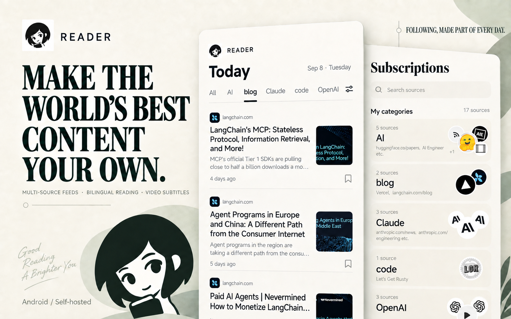
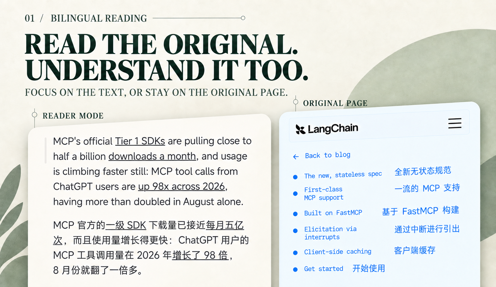
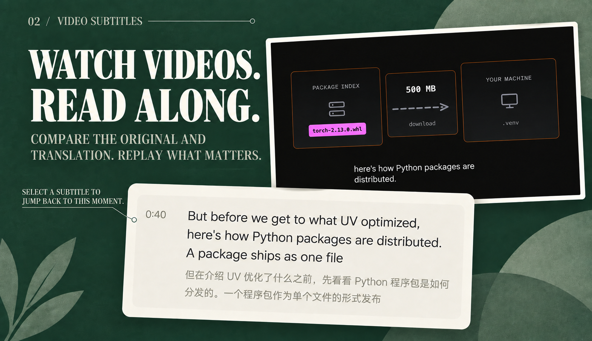

<h1 align="center">Reader</h1>

<strong>Bring what you follow together. Read it in a language you know.</strong>

Multi-source subscriptions · Trending rankings · Bilingual web reading · YouTube subtitle translation · Self-hosted

<a href="README.md">简体中文</a> · <strong>English</strong>

  <a href="#getting-started">Getting Started</a> ·
  <a href="#current-release-status">Current Status</a> ·
  <a href="#reading-experience">Reading Experience</a> ·
  <a href="#trending-rankings">Trending Rankings</a> ·
  <a href="#sources-and-discovery">Supported Sources</a> ·
  <a href="docs/deployment.md">Deployment Guide</a>

  

Reader is a self-hosted information aggregation app. Bring blogs, communities, websites, and video channels into one reading space, organize subscriptions around your interests, read translations alongside the original text, and save content worth revisiting.

- **Make following a daily habit.** Updates from multiple sources flow into the Today timeline. Organize your reading topics with folders, or discover something new through trending rankings.
- **Understand more, then go deeper.** Read articles and web pages in bilingual views. For YouTube videos, follow the subtitle timeline, jump to a line, and replay it.
- **Connect to your own service.** Subscriptions, saved items, and accounts live on the Reader service you connect to. The service operator configures the translation models.

## Current release status

> [!WARNING]
> Reader is currently a development preview, not a production release. Known issues remain, and parts of the experience are still being refined.

- **Web extraction:** The web extraction rules Agent still needs improvement to recognize and parse a wider range of pages. Some websites may not return article lists or content correctly.
- **X sign-in:** The Android client now uses the same OAuth popup mechanism as Reddit; whether completing or cancelling Google sign-in reliably returns to the original X page still requires real-device verification.
- **Interaction quality:** Page interactions, transition animations, and loading feedback still need further refinement.

## Getting started

**Android is currently the primary platform for usage and validation. Preview APKs are available from [GitHub Releases](https://github.com/ccpowe/reader/releases).** The client must connect to a Reader backend; the project does not currently provide a publicly hosted service.

1. **Prepare the service.** Follow the [deployment guide](docs/deployment.md) to configure PostgreSQL and start the Reader API and Worker. If a service is already available, ask its administrator for the service URL and connection token.
2. **Prepare the client.** Download an APK from GitHub Releases, or follow the [frontend development and APK build instructions](mobile/AGENTS.md#环境与命令), use the `preview` profile, and build an installable standalone Android APK.
3. **Start reading.** Enter the service URL and connection token on the connection screen, register or sign in to a Reader account, and add your first subscription.

The minimum deployment consists of **Reader API + Worker + PostgreSQL**. Registration does not require email verification. Translation models are optional; the service operator is responsible for server and third-party API costs.

> [!CAUTION]
> **X / Scweet risk notice**
>
> - X collection is optional and currently uses the unofficial Scweet service with an X web-login cookie.
> - Create a secondary account dedicated to Reader instead of using your primary personal account. Keep its cookie only on the deployment host; never commit it to Git or send it through chat.
> - X may change its policies, pages, or enforcement at any time, and collection may trigger rate limits, login challenges, or account restrictions. This project cannot guarantee continued X availability or prevent, reverse, or recover an account restriction. Operators must assess these risks and comply with applicable policies and local law.
> - Without this configuration, only X synchronization is unavailable; other sources and reading features continue to work. See the [deployment guide](docs/deployment.md#x-内容可选scweet) for setup details.

## Reading experience

### Read the original—and understand it

  

If some articles are missing a title or link while others can still be fetched, the subscription screen reports that updates are working but some articles could not be parsed. If nothing can be parsed, it continues to show an error state.

**Web and RSS articles open in the original in-app web page by default**, preserving the website's content and interactions. Select Reader Mode to extract the main content from the currently loaded page and display it in a consistent layout. You can switch back to the original page at any time or open it in the system browser.

Reader Mode uses the current web page; it does not switch content sources based on whether the RSS feed contains a full article. If the page cannot be extracted or has not finished loading, Reader keeps the original page available and explains why, without stopping subscription updates. Extracted content is only used for the current reading session—it is not automatically saved for offline use or synchronized to other devices.

Choose between original, bilingual, and translation-only views. While a translation is pending or if it fails, the original remains readable. The backend currently supports configurable **DeepSeek** and **OpenRouter** integrations.

### Watch a video—and read along

  

Play YouTube videos in the app and optionally enable bilingual player subtitles, or follow the original and translated text in the subtitle timeline below. **Select any subtitle to jump to that moment**, making it easy to replay something you missed. Translation display can be controlled separately for the player and the subtitle timeline.

Subtitle features depend on captions provided by the video. Reader does not currently transcribe videos that have no captions, and availability can also be affected by YouTube page and player behavior.

## Trending rankings

### Discover beyond your subscriptions

  

Open Rankings and switch between **Hacker News, Reddit, and GitHub** to discover discussions, articles, and open-source projects beyond your subscriptions.

- **Hacker News:** Browse technology articles and discussions, using scores and comment counts to find promising stories.
- **Reddit:** Select from communities you subscribe to and browse by hot, top, or rising. Add a Reddit community subscription before using this view.
- **GitHub:** Discover open-source projects worth following.

When something looks interesting, open it to continue reading or **save it and return from the Saved screen later**.

These are AI-assisted editorial compositions based on screenshots from a physical Android device, not pixel-for-pixel UI screenshots. The rankings image uses Hacker News as its example. See the <a href="docs/assets/readme/README.md">asset notes</a> for the original material, versions, and sources.

## Sources and discovery

| Source | What you can follow | Requirements |
| --- | --- | --- |
| **RSS / Atom** | Blogs, news sites, and public feeds | Add the feed URL |
| **Websites** | Article lists from public blogs | Reader first looks for RSS / Atom. If no usable feed is available and a rules Agent is configured on the server, it attempts to discover article updates. Sites requiring sign-in or using anti-bot protections may not work; not every website is supported |
| **Reddit** | Community posts | Add a community source |
| **YouTube** | Channel updates | Optionally configure the YouTube Data API; otherwise Reader uses the public Atom feed |
| **X** | Public posts from an account | Uses Scweet and a dedicated secondary-account cookie; platform policy, rate-limit, and account-restriction risks apply |

A website subscription may initially discover only currently available articles, and historical coverage can be limited. The backend stores the rules Agent's decisions and limitations for administrators to inspect. Main-content extraction does not determine whether a subscription succeeds.

## Self-hosted reading spaces, managed by service

The Android client connects to a service at runtime, so server URLs and translation credentials do not need to be embedded in the APK. Accounts, subscriptions, and saved items are stored by the connected Reader service and its database.

Download the Android preview APK from [GitHub Releases](https://github.com/ccpowe/reader/releases). The current build targets arm64-v8a devices; after installation, enter your own Reader service URL and connection token in the app.

One client can switch between multiple Reader services. Sessions and local caches are isolated by service. Switching services does not migrate subscriptions, saved items, or account data from the previous service.

## Frequently asked questions

<strong>Can I use Reader without configuring a translation model?</strong>

Yes. Subscriptions, original-text reading, rankings, and saved items do not depend on a translation model. When translation is needed, an administrator can configure DeepSeek or OpenRouter, and users can select an available engine in the app. See the [backend environment variable example](backend/.env.example) for configuration options.

<strong>Are iOS and Web supported?</strong>

The client uses Expo and React Native. Android is currently the primary platform for usage and validation. iOS and Web have not completed release-level validation, and the WebView-based reading features currently use native implementations.

<strong>Can every web page be translated completely?</strong>

Web translation can be affected by site layouts, sign-in state, dynamic loading, and embedded content. For an incompatible page, switch to Reader Mode where supported or continue reading in the system browser.

## Documentation and feedback

| What you want to do | Start here |
| --- | --- |
| Deploy a Reader service | [Deployment guide](docs/deployment.md) · [Backend documentation](backend/README.md) · [Environment variable example](backend/.env.example) |
| Develop or build the client | [Repository development guidelines](AGENTS.md) · [Frontend and APK builds](mobile/AGENTS.md) · [Backend development](backend/AGENTS.md) |
| Understand the system design | [Architecture overview](docs/ARCHITECTURE.md) · [C4 model](architecture/workspace.dsl) |
| Inspect the API | [Reader API OpenAPI](contracts/openapi.json) |

When reporting a problem, include the app version, reproduction steps, and the affected screen. For web-page or subtitle issues, attach a public URL and screenshot when possible, without including credentials or private content.

**Public release:** The project is preparing for its first public release. Public download and feedback channels have not yet been finalized.

## License

Reader source code is released under the [MIT License](LICENSE), Copyright © 2026 ccpowe.

Third-party dependencies and assets retain their own copyright and license terms; adopting MIT for Reader does not alter them. The license notice for code originating from Expo is preserved in [mobile/LICENSE-EXPO](mobile/LICENSE-EXPO). Articles, video frames, and website marks shown in the editorial images belong to their respective sources and are not included in Reader's MIT license grant.
