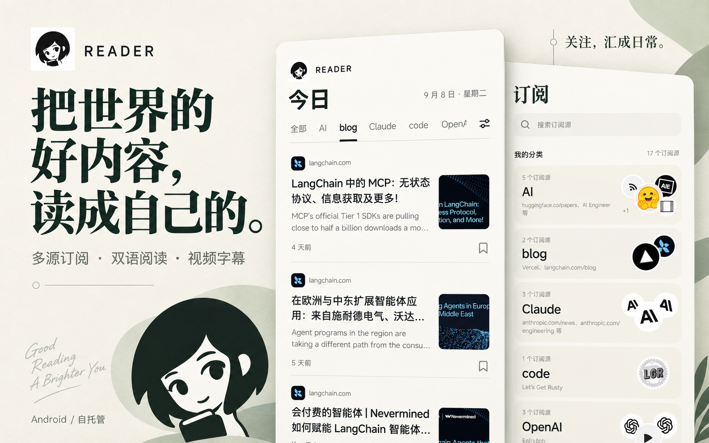
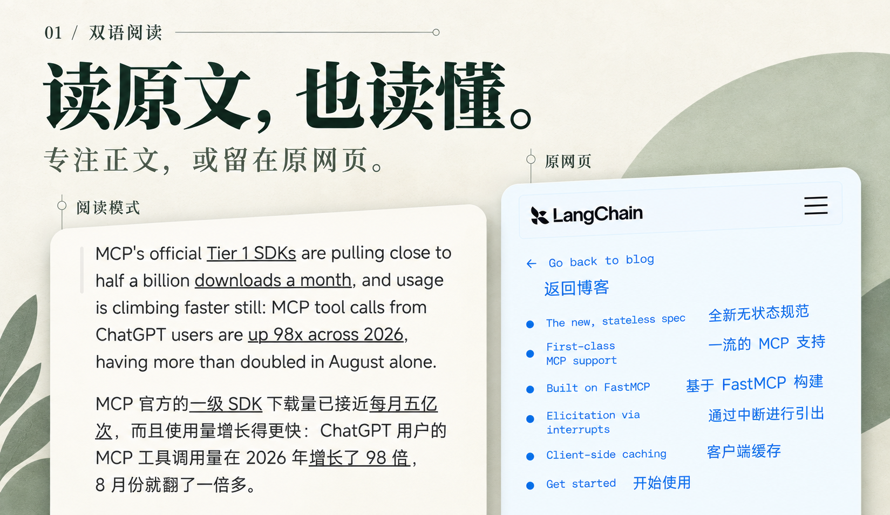
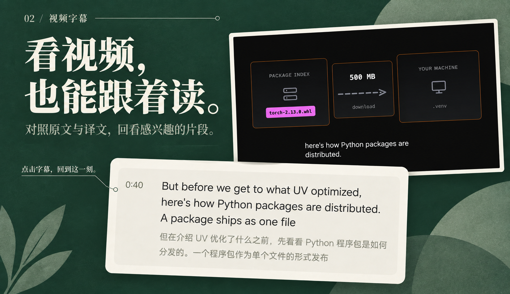

<h1 align="center">Reader</h1>

<p align="center"><strong>把关注的信息汇集起来，用熟悉的语言阅读。</strong></p>

<p align="center">多源订阅 · 热门榜单 · 网页双语阅读 · YouTube 字幕翻译 · 自托管</p>

<p align="center"><strong>简体中文</strong> · <a href="README.en.md">English</a></p>

<p align="center">
  <a href="#开始使用">开始使用</a> ·
  <a href="#当前版本状态">当前状态</a> ·
  <a href="#阅读体验">阅读体验</a> ·
  <a href="#热门榜单">热门榜单</a> ·
  <a href="#来源与发现">支持的来源</a> ·
  <a href="docs/deployment.md">部署指南</a>
</p>

<p align="center">
  
</p>

Reader 是一个自托管信息聚合应用。把博客、社区、网站和视频频道放进同一个阅读空间，按兴趣整理订阅，在原文旁边读译文，收藏值得回看的内容。

- **关注，汇成日常。** 多种来源汇入「今日」时间线，用文件夹整理自己的阅读主题；频道选择器会提示各来源自上次打开后的新增数量，也可勾选哪些频道显示在「全部」中。
- **读懂，再读深入。** 「今日」中的 X 推文会按个人偏好自动翻译；文章和网页支持双语对照；看 YouTube 时，可以沿着字幕轴阅读、跳转和回看。
- **连接自己的服务。** 订阅、收藏和账号保存在你连接的 Reader 服务中，翻译模型由部署者配置。

## 当前版本状态

> [!WARNING]
> Reader 当前为开发预览版，并非正式发布版本，仍有已知问题和待完善的体验。

- **网页提取：** 网页爬取规则 Agent 仍需完善，以提升不同页面的识别与解析能力；部分网站可能无法正确获取文章列表或内容。
- **X 登录：** Android 客户端已接入与 Reddit 相同的 OAuth 弹窗机制；Google 登录完成或取消后能否稳定返回原 X 页面仍待真机验证。
- **交互体验：** 页面交互、过渡动画和加载反馈仍需继续优化。

## 开始使用

**目前以 Android 为主要使用和验证平台，可从 [GitHub Releases](https://github.com/ccpowe/reader/releases) 下载预览版 APK。** 客户端需要连接 Reader 后端；项目目前未提供公共托管服务。

1. **准备服务。** 按[部署指南](docs/deployment.md)配置 PostgreSQL，启动 Reader API 和 Worker。如果已有可用服务，向管理员获取服务地址和连接 token。
2. **准备客户端。** 从 GitHub Releases 下载安装包，或按[前端开发与 APK 构建约定](mobile/AGENTS.md#环境与命令)，使用 `preview` profile 构建并安装可独立运行的 Android APK。
3. **开始阅读。** 在连接页填写服务地址和连接 token，注册或登录 Reader 账号，然后添加第一个订阅。

最小运行组合为 **Reader API + Worker + PostgreSQL**。注册无需邮箱验证；翻译模型按需配置，服务器和第三方 API 的费用由部署者承担。

使用 Docker 的最短流程如下；完整配置、升级、网络、备份和密钥边界见
[Docker Compose 部署文档](docs/docker-deployment.md)：

```bash
cp .env.docker.example .env.docker
./docker-init.sh init
# 将实际使用的模型 key 写入 .docker/inputs/deepseek-api-key 或 openrouter-api-key
./docker-init.sh up
./docker-init.sh token
```

API 默认只监听 `127.0.0.1:8000`。`token` 输出供客户端连接的 token；模型 key、数据库密码
和 JWT 密钥不会写入镜像或 Git。Codex 订阅使用[独立凭据导入与自动续期](docs/deployment.md#codex-订阅翻译)。未配置默认引擎凭据时原文阅读等功能仍可使用，但
`/worker-ready` 会保持 503，表示翻译循环尚未就绪。

> [!CAUTION]
> **X / Scweet 风险提示**
>
> - X 内容采集是可选能力，当前使用非官方 Scweet 服务和 X 网页登录 Cookie。
> - 建议注册仅供 Reader 使用的小号，不要使用个人主账号；Cookie 只能保存在部署主机，不要提交到 Git 或发送到聊天中。
> - X 的政策、页面和限制机制可能随时变化，也可能触发限流、登录验证或账号限制。本项目无法保证 X 采集持续可用，也无法避免、解除或恢复账号限制；启用者需自行评估风险并遵守适用政策与当地法律。
> - 不配置时只有 X 同步不可用，其他来源和阅读功能不受影响。配置方法见[部署指南](docs/deployment.md#x-内容可选scweet)。

## 阅读体验

### 读原文，也读懂

<p align="center">
  
</p>

部分文章缺少标题或链接、其他文章仍能正常获取时，订阅页提示“正常更新，部分文章无法解析”；完全无法解析时仍显示异常提示。

**Web 和 RSS 文章默认打开应用内原网页**，保留网站的内容和交互。点击“阅读模式”后，Reader 从当前已加载的页面提取正文，以统一样式排版；可以随时切回原网页，也可以交给系统浏览器打开。

阅读模式使用当前网页，不根据 RSS 是否提供正文切换内容来源。页面无法提取或尚未加载时，会保留原网页并提示原因，不影响订阅继续更新。正文提取结果仅供当前阅读使用，不会自动保存为离线文章或同步到其他设备。

支持原文、双语和纯译文显示。等待翻译或翻译失败时，仍可继续阅读原文。目前支持由服务端配置 **DeepSeek**、**OpenRouter** 或 **Codex 订阅**（默认 `gpt-6-luna`，推理强度 `low`）。

### 看视频，也能跟着读

<p align="center">
  
</p>

在应用内播放 YouTube 视频，按需开启播放器双语字幕，或在下方字幕轴中对照原文和译文。**点击一句字幕，就能跳转到对应位置**，方便回看没听清的内容；播放器与字幕轴的翻译显示可以分别切换。

字幕功能依赖视频提供的可用字幕，当前不包含无字幕视频的语音转写；实际可用性也受 YouTube 页面和播放器行为影响。

## 热门榜单

### 关注之外，还有好发现

<p align="center">
  
</p>

打开「榜单」，在 **Hacker News、Reddit、GitHub** 之间切换，从热门讨论、文章和开源项目中发现订阅之外的内容。
服务器已有的榜单译文会随榜单一起显示；尚无译文的内容继续显示原文，并在页面内按需补充翻译。

- **Hacker News：** 浏览技术文章与讨论，结合得分和评论数挑选感兴趣的条目。
- **Reddit：** 从已订阅的社区中选择频道，按热门、最高分或上升趋势浏览话题；使用前需先添加 Reddit 社区订阅。
- **GitHub：** 发现值得关注的开源项目。

遇到感兴趣的条目，可以打开继续阅读，也可以**加入收藏，之后从「收藏」页重新打开**。

<p align="center"><sub>以上为基于 Android 真机截图的 AI 辅助合成展示图，非逐像素界面截图；榜单图以 Hacker News 页面为例。原始素材、版本与来源见<a href="docs/assets/readme/README.md">素材说明</a>。</sub></p>

## 来源与发现

| 来源 | 可以关注什么 | 接入条件 |
| --- | --- | --- |
| **RSS / Atom** | 博客、新闻站点、公开订阅源 | 添加订阅地址 |
| **网站** | 公开博客的文章列表 | 优先检测 RSS / Atom；没有可用 feed 时，在服务端已配置规则 Agent 的情况下尝试获取文章更新。需登录或有反爬限制的网站可能无法订阅，不保证所有网站可用 |
| **Reddit** | 社区帖子 | 添加社区来源 |
| **YouTube** | 频道更新 | 可配置 YouTube Data API；未配置时使用公开 Atom feed |
| **X** | 账号公开内容 | 使用 Scweet 和专用小号 Cookie；存在平台政策、限流和账号限制风险 |

网站订阅可以先发现当前文章，历史获取范围可能有限。服务端保存规则 Agent 的判断与限制，管理员可查看；正文提取不决定订阅是否成功。

## 自托管，按服务管理自己的阅读空间

Android 客户端在运行时连接服务，不需要在安装包中写入服务器地址或翻译密钥。账号、订阅和收藏由所连接的 Reader 服务及其数据库保存。

可前往 [GitHub Releases](https://github.com/ccpowe/reader/releases) 下载 Android 预览版安装包。当前提供 arm64-v8a 版本，安装后在应用内输入自己的 Reader 服务地址和连接 token。

一个客户端可以切换多个 Reader 服务，会话和本地缓存按服务隔离。切换服务不会自动迁移原服务中的订阅、收藏和账号数据。

内置网页阅读器自动回收网站的资源缓存，清理时保留 Cookie 及站点登录相关存储。升级前积累的网站 CacheStorage 会在再次打开对应网站后回收；网页阅读需要联网，不提供离线保存保证。

## 常见问题

<details>
<summary><strong>不配置翻译模型，可以使用吗？</strong></summary>

可以。订阅、原文阅读、榜单和收藏不依赖翻译模型。需要翻译时，再由管理员配置 DeepSeek、OpenRouter 或 Codex 订阅，并在应用中选择可用引擎。配置项见[后端环境变量示例](backend/.env.example)，Codex 登录与续期见[部署说明](docs/deployment.md#codex-订阅翻译)。

</details>

<details>
<summary><strong>支持 iOS 和 Web 吗？</strong></summary>

代码使用 Expo / React Native，目前以 Android 为主要使用和验证平台。iOS 和 Web 尚未完成发布级验证，WebView 阅读能力目前为原生实现。

</details>

<details>
<summary><strong>所有网页都能完整翻译吗？</strong></summary>

网页翻译会受到站点布局、登录状态、动态加载和嵌入内容的影响。遇到不兼容的页面，可以在支持的情况下切换阅读模式，或使用系统浏览器继续阅读。

</details>

## 文档与反馈

| 想做什么 | 从这里开始 |
| --- | --- |
| 部署 Reader 服务 | [Docker Compose 部署](docs/docker-deployment.md) · [综合部署指南](docs/deployment.md) · [后端说明](backend/README.md) |
| 开发或构建客户端 | [仓库开发约定](AGENTS.md) · [前端与 APK 构建](mobile/AGENTS.md) · [后端开发](backend/AGENTS.md) |
| 理解系统设计 | [架构说明](docs/ARCHITECTURE.md) · [C4 模型](architecture/workspace.dsl) |
| 查看接口 | [Reader API OpenAPI](contracts/openapi.json) |

反馈问题时，请说明应用版本、复现步骤和相关页面；网页或字幕问题可以附上公开网址和截图，避免包含账号凭证或私人内容。

**公开发布：** 项目正在准备首次公开发布，公开下载和反馈入口尚待确定。

## 许可

Reader 项目代码以 [MIT License](LICENSE) 发布，Copyright © 2026 ccpowe。

第三方依赖和素材保留各自的版权及许可条款，不因项目采用 MIT 而改变。Expo 来源代码的许可声明见 [mobile/LICENSE-EXPO](mobile/LICENSE-EXPO)；展示图中的文章、视频画面及网站标识归各自来源所有，不包含在 Reader 的 MIT 授权范围内。
